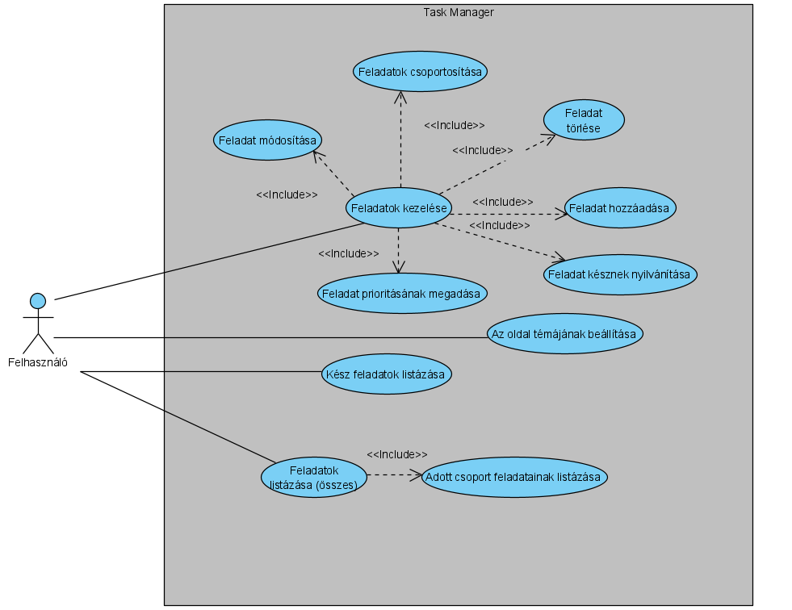

# Task Manager funkcionális specifikáció

## 1. A rendszer céljai és nem céljai

### 1.1 A rendszer céljai

Az elkészített rendszerrel a felhasználó képes lesz:

* feladatait egy helyen, átláthatóan nyomonkövetni, felesleges szemét *(cetlik)* generálása nélkül
* új feladatokat hozzáadni, módosítani a már létrehozottakat
* csoportosítani a feladatokat
* megadni a feladatok fontosságát *(prioritás)*
* törölni, ha esetleg rosszul adott meg valamit, vagy késznek nyilvánítani a feladatokat
* feladatok listázása *(összes vagy egy adott csoport)*
* az elkészített feladatok listájának lekérdezésére
* megváltoztatni az oldal témáját *(dark/light/colorblind)*
* a fentebb felsoroltakat akármilyen internethasználatra alkalmas eszközön végrehajtani

### 1.2 A rendszer ***NEM*** céljai

Az elkészített rendszerrel a felhasználó ***NEM*** lesz képes:

* több felhasználó adatait külön-külön kezelni
* megtekinteni, hogy milyen akciókat hajtott végre az oldalon belül *(log)*
* széleskörűen testreszabni a rendszert *(értsd: csak light/dark/colorblind téma)*
* egyszerre több csoportba is elhelyezni egy feladatot
* a hozzáadott feladatokat rendezni *('érkezési sorrend')*

## 2. Jelenlegi helyzet

Egyre több a felhalmozódó feladat, amiket egyre nehezebb nyomon követni.
Jelenleg egy táblán külön csoportokra bontva, azon belül cetlikre íródnak a feladatok.
Ez a módszer nem a legoptimálisabb, macerás átrendezni stb... (A matricák veszítenek a tapadósságból ==> sok szemét  + költség)

## 3. Vágyálom rendszer

Egy könnyen átlátható és kezelhető weboldal, ahol könnyen megvalósíthatóak a folyamatok. 
Egyszerű szerkeszthetőség. Szeretném weboldalunk online kezelését is megoldani, hogy  távolról is láthassam az aktuális információkat.
Nem elfogadható csak Microsoft Windows operációs rendszeren üzemeltethető rendszerre vonatkozó javaslat.
A weboldal könnyen üzemeltethető legyen. Elvárt a platformfüggetlenség.
Az online megjelenés lehetőleg mobil telefonon, tableten is működjön, reszponzív felülettel.

## 4. Jelenlegi üzleti folyamatok

* Új feladat hozzáadása (Cetlire írás -> cetli letépése -> cetli táblára ragasztása)
* Feladat törlése (Cetli levétele a tábláról -> cetli kukába dobása)
* Feladatok csoportosítása (Cetlik egy adott helyre csoportosítása a táblán)
* Feladat késznek nyilvánítása (Cetli ‘kész’ csoportba helyezése)
* Feladat frissítése/módosítása (Új cetli írása(új feladat))

## 5. Igényelt üzleti folyamatok

* Feladat módosítása (Modify/Update task)
* Feladat határidő megadása (Deadline)
* Felhasználóbarát UI (Dark/Light mode + Színvak mode)
* Feladatok prioritásának megadása (Prioritizing tasks)

## 6. Követelménylista

* Könnyen üzemeltethető rendszer
* Reszponzív design

## 7. Használati esetek

### 7.1 Aktorok meghatározása

Esetünkben az egyetlen aktorként a ***felhasználót*** sorolnám fel, mivel rendszerünkkel más nem tud interakcióba lépni.

### 7.2 Használati eset diagram

## 8. Megfeleltetés

## 9. Képernyőtervek

 * Legyen teljes , a felhasználó a felhasználói felületen keresztül a program minden funkciója elérhető legyen.
 * A felhasználói felület legyen szellős és átlátható, jól különüljenek el egymástól az egyes funkciók, funkció csoportok.
 * A felületnek olyan kifejezéseket kell használnia, amelyek megfelelnek a rendszert legtöbbet használók tapasztalatainak.
 * A felületnek konzisztensnek kell lennie, azaz lehetőség szerint hasonló műveleteket hasonló módon kell realizálnia.
 * Legyen visszaállíható , a felületnek rendelkeznie kell olyan mechanizmusokkal , amelyek lehetővé teszik a felhasználók számára a hiba után történő visszaállítást.
 * A felületnek megfelelő interakciós lehetőségekkel kell rendelkeznie a
   rendszer különféle felhasználói számára.

## 10. Forgatókönyvek
Elfelejtő Jenő a mindennapok során egyre több és több feladattal találja szembe magát és ez nagyon megerölteti pici agyát. Nem tudja , hogy mikor mit és hol kellene csinálnia , így gyakran csak a napot lopja. Próbálta már a teendőit kezére , cetlikre felírni. De a sok-sok cetlit nem bírta magával cipelni. Kétségbe esvén , nem tudván mit tegyen barátja Bará Tamás mutatott neki egy honlapot , ahol csupán internetre lesz szüksége és akár telefonról , táblagépről , számítógépről a napi teendőit bármikor elérheti. Teendőivel ha kész van nyugodtan törölheti és az összes kis "cetlit" a zsebében cipelheti. Ezután Elfelejtő Jenő fejéből teendő el nem vész és minden munkájával időben kész.
